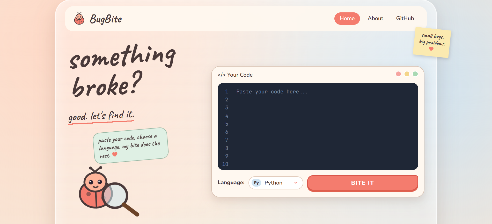
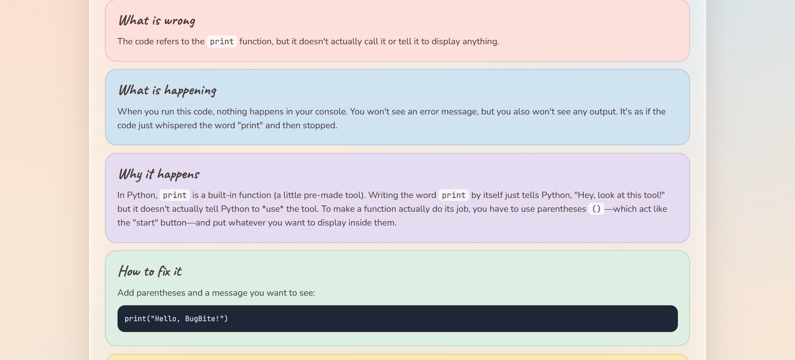
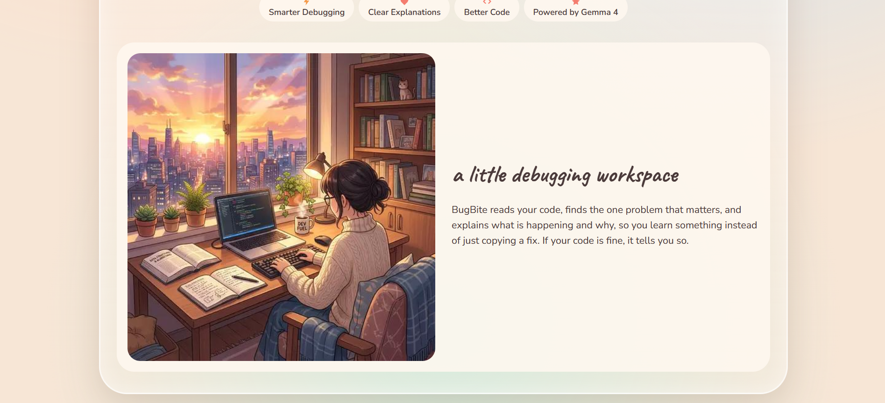
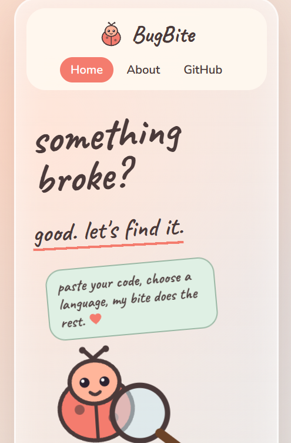

# BugBite

BugBite is a lightweight code debugging assistant designed to make debugging easier to understand, especially when you are still learning.

Instead of simply pointing out an error, BugBite explains what is going wrong, why it is happening, and what can be done to fix it. The goal is to make debugging feel less like decoding an error message and more like understanding what your code is trying to do.

## Overview

BugBite lets you paste a piece of code, select its programming language, and send it for analysis. The application processes the request through a Node.js backend and uses Google's GenAI API with Gemma to generate the explanation.

The API key is kept on the backend and is never exposed to the frontend.

The application is designed to work across both desktop and mobile screens, with the interface built around a simple and approachable debugging workflow.

## How It Works

The basic flow is:

Frontend → Express backend → Google GenAI / Gemma → Express backend → Frontend

The frontend collects the code and selected language and sends it to the backend. The backend prepares the request for Gemma and returns the generated analysis to the frontend.

The response focuses on five things:

* What is wrong
* What is happening
* Why it happens
* How to fix it
* What should be checked next

If the submitted code appears to be valid, BugBite is instructed not to invent an error simply to provide an answer.

## Features

BugBite currently supports code analysis for several commonly used languages, including Python, JavaScript, Java, C, C++, HTML, CSS, and SQL.

The interface includes a dedicated code analysis experience, an informational section explaining the project, and a responsive layout for smaller screens.

The project is also structured so that additional languages, debugging behaviour, and interface features can be added without rebuilding the application from scratch.

## Screenshots

### Home



### Analyzer



### About



### Mobile



## Tech Stack

BugBite uses a simple full-stack architecture.

The frontend is built with HTML, CSS, and JavaScript.

The backend uses Node.js and Express to handle requests and communicate with the GenAI API.

Google GenAI and Gemma are used for the code analysis and debugging explanations.

The project uses environment variables for configuration so that API credentials remain outside the source code.

## Running Locally

Clone the repository and move into the project directory.

Create a `.env` file based on `.env.example` and add your Google GenAI API key:

```text
GEMINI_API_KEY=your_api_key_here
```

Then install the backend dependencies:

```bash
cd backend
npm install
```

Start the application:

```bash
npm start
```

The application will be available at:

```text
http://localhost:3000
```

The backend also exposes a health endpoint at:

```text
http://localhost:3000/health
```

Never commit your `.env` file or expose your API key publicly.

## Contributing

BugBite is an open-source project and contributions are welcome.

If you want to contribute, you can work on improving the debugging experience, adding language support, improving the interface, making the application more accessible, improving mobile behaviour, refining the prompts used for analysis, or adding new features.

Before starting a larger change, it is recommended to open an issue and discuss the idea first. For smaller fixes and improvements, feel free to create a pull request directly.

Please keep contributions focused, readable, and consistent with the existing project structure.

## Future Development

BugBite is still evolving.

Some areas that can be explored include better error detection, support for more programming languages, richer explanations, improved code highlighting, debugging history, more detailed analysis of runtime errors, and additional developer tools.

The project is intentionally kept simple at its core so that new features can be built on top of it without making the debugging workflow unnecessarily complicated.

## License

This project is licensed under the MIT License.
